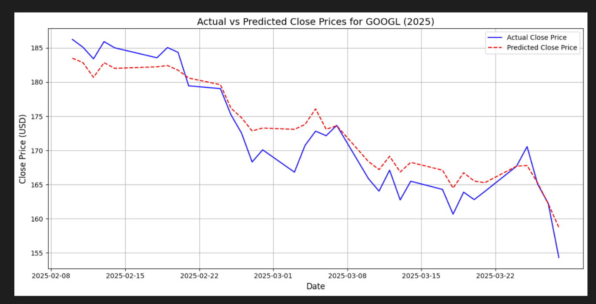

# Forecasting Stock Prices Using LSTM Neural Networks

## Overview

This project builds a deep learning pipeline to forecast next-day closing prices for stocks like Google (GOOGL) using Long Short-Term Memory (LSTM) neural networks. It combines technical indicators derived from historical price data with company fundamentals to capture both short-term market dynamics and long-term valuation context.

**Target stakeholders:** swing traders, financial analysts, and portfolio managers seeking data-driven short-term forecasting tools.

---
## Why LSTM?
Stock prices are sequential time series data where past values directly influence future ones. Traditional models like ARIMA assume stationarity and linearity — conditions that rarely hold in financial markets. Tree-based models like XGBoost can handle non-linearity but treat each timestep independently, losing the temporal structure.
LSTMs are a type of Recurrent Neural Network (RNN) specifically designed to learn long-range dependencies in sequential data. Their key advantages for stock forecasting:

* Memory across time: LSTM cells use gates (input, forget, output) to selectively retain or discard information across timesteps, allowing the model to "remember" relevant price history
* Non-linearity: Captures complex, non-linear patterns that traditional statistical models miss
* Flexibility with features: Easily incorporates mixed inputs — lagged prices, technical indicators, and fundamentals — in a single unified model
* Proven in finance: Prior research consistently shows LSTM outperforms ARIMA and standard RNNs on financial time series tasks

## Results

| Metric | Value |
|--------|-------|
| Validation Loss (MSE) | 33.29 |
| Training RMSE | 4.17 |
| R² Score (Test Set) | **96.30%** |

The model explains over 96% of the variance in next-day closing prices on unseen test data, and was validated on early 2025 data (trained through January 2025).

## Actual vs Predicted Close Prices — GOOGL (2025)


The model successfully tracks the overall downward trend in GOOGL's price across February–March 2025, despite this data being entirely unseen during training. The predicted prices (dashed red) closely follow the actual prices (solid blue), with slight smoothing during sharp intraday drops.
---

## Data Sources

- **Yahoo Finance (`yfinance`)** — historical OHLCV price data for GOOGL (2010–2025, excluding 2020)
- **Alpha Vantage API** — quarterly income statements, balance sheets, and cash flow statements

> **Note:** To reproduce results, you will need your own Alpha Vantage API key. Run `Data Wrangling.ipynb` first to generate the required CSV files before running the modeling notebook.

---

## Features Used

### Technical Indicators
| Feature | Purpose |
|---------|---------|
| RSI (14-day) | Momentum — overbought/oversold detection |
| MACD | Trend-following — bullish/bearish shifts |
| Bollinger Bands | Volatility and mean-reversion |
| Lag Features (5, 10, 20 days) | Temporal memory for LSTM |

### Company Fundamentals
| Feature | Purpose |
|---------|---------|
| P/E Ratio | Market valuation relative to earnings |
| EPS | Profitability indicator |
| Market Cap | Company size |
| Dividend Yield | Shareholder return signal |

**Excluded features:** Redundant moving averages (SMA, EMA variants), ATR, OBV, and long-term financial ratios — these were captured more effectively by the selected indicators.

---

## Model Architecture

A Sequential LSTM model trained with the Adam optimizer and MSE loss:

```
Input: (batch_size, 1, 17 features)
→ LSTM Layer (64 units, ReLU, return_sequences=True)
→ Dropout (0.2)
→ LSTM Layer (64 units, ReLU)
→ Dense Output (1 neuron)
```

- **Target:** Next-day closing price (shifted by 2 days)
- **Preprocessing:** StandardScaler normalization, chronological train/test split (no shuffling)
- **Training:** 35 epochs, batch size 32

---

## Repository Structure

```
├── Data Wrangling.ipynb              # Data collection, technical indicator computation, merging
├── Feature_Engineering_and_Modeling.ipynb  # Feature selection, LSTM model, evaluation
├── merged_df.csv                 # Generated merged dataset (optional)
└── README.md
```

> `*.h5` model files and Alpha Vantage CSVs are excluded from the repository. Run the notebooks to regenerate them.

---

## Setup

```bash
pip install yfinance tensorflow scikit-learn ta pandas numpy matplotlib
```

Then run in order:
1. `Data Wrangling.ipynb` — requires an Alpha Vantage API key
2. `Feature_Engineering_and_Modeling.ipynb`

---

## Limitations

- Trained on stable large-cap stocks (GOOGL, AAPL); may not generalize well to high-volatility stocks like NVIDIA
- Macroeconomic signals (CPI, interest rates) not included
- LSTM is a black-box model — limited interpretability
- Static treatment of quarterly financials (P/E, EPS, etc.)

## Future Work

- Extend to volatile stocks and cross-asset prediction
- Integrate macroeconomic indicators
- Apply explainability methods (SHAP, LIME)
- Explore Transformer-based architectures for longer-range dependencies
